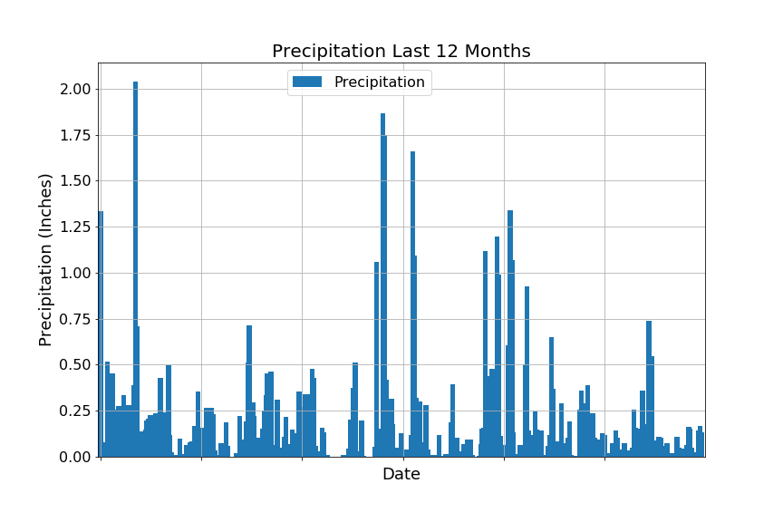

```python
# Python SQL toolkit and Object Relational Mapper
import sqlalchemy
from sqlalchemy.ext.automap import automap_base
from sqlalchemy.orm import Session
from sqlalchemy import create_engine, inspect, func
import datetime as dt
from dateutil.relativedelta import relativedelta
import pandas as pd
import numpy as np
import matplotlib.pyplot as plt
```


```python
# Connect to SQL database
engine = create_engine("sqlite:///hawaii.sqlite", echo=False)
```


```python
# Inspect database
inspector = inspect(engine)
inspector.get_table_names()
```


    ['measurements', 'stations']


```python
# Get a list of column names and types for measurements table
columns = inspector.get_columns('measurements')
for c in columns:
    print(c['name'], c["type"])
```

    id INTEGER
    station VARCHAR(255)
    date VARCHAR(255)
    prcp FLOAT
    tobs INTEGER
    


```python
# Get a list of column names and types for stations table
columns = inspector.get_columns('stations')
for c in columns:
    print(c['name'], c["type"])
```

    id INTEGER
    station VARCHAR(255)
    name VARCHAR(255)
    latitude FLOAT
    longitude FLOAT
    elevation FLOAT
    


```python
engine.execute('SELECT * FROM measurements LIMIT 5').fetchall()
```


    [(0, 'USC00519397', '2010-01-01', 0.08, 65),
     (1, 'USC00519397', '2010-01-02', 0.0, 63),
     (2, 'USC00519397', '2010-01-03', 0.0, 74),
     (3, 'USC00519397', '2010-01-04', 0.0, 76),
     (4, 'USC00519397', '2010-01-06', 0.0, 73)]


```python
# Reflect the tables into classes and save a reference to those classes called Station and Measurement
Base = automap_base()
Base.prepare(engine, reflect=True)
Measurement = Base.classes.measurements
Station = Base.classes.stations
```


```python
session = Session(engine)
```

# Precipitation Analysis


```python
# Earliest Date
session.query(Measurement.date).order_by(Measurement.date).first()
```


    ('2010-01-01')


```python
# Latest Date
latest_date = session.query(Measurement.date).order_by(Measurement.date.desc()).first()
latest_date
```


    ('2017-08-23')


```python
# Date 12 months ago
last_twelve_months = dt.date.today() - relativedelta(months=12)
last_twelve_months
```


    datetime.date(2017, 7, 3)


```python
# Retrieve the last 12 months of precipitation data
p_results = session.query(Measurement.date, func.avg(Measurement.prcp)).\
                    filter(Measurement.date >= last_twelve_months).\
                    group_by(Measurement.date).all()
p_results
```


    [('2017-07-03', 0.10571428571428572),
     ('2017-07-04', 0.037500000000000006),
     ('2017-07-05', 0.0),
     ('2017-07-06', 0.0033333333333333335),
     ('2017-07-07', 0.07142857142857142),
     ('2017-07-08', 0.016666666666666666),
     ('2017-07-09', 0.03333333333333333),
     ('2017-07-10', 0.005714285714285714),
     ('2017-07-11', 0.004285714285714286),
     ('2017-07-12', 0.051428571428571435),
     ('2017-07-13', 0.25857142857142856),
     ('2017-07-14', 0.15833333333333335),
     ('2017-07-15', 0.03166666666666667),
     ('2017-07-16', 0.135),
     ('2017-07-17', 0.15166666666666667),
     ('2017-07-18', 0.3614285714285714),
     ('2017-07-19', 0.06833333333333334),
     ('2017-07-20', 0.17714285714285713),
     ('2017-07-21', 0.018571428571428572),
     ('2017-07-22', 0.7366666666666667),
     ('2017-07-23', 0.22600000000000003),
     ('2017-07-24', 0.5449999999999999),
     ('2017-07-25', 0.08714285714285715),
     ('2017-07-26', 0.07142857142857142),
     ('2017-07-27', 0.0014285714285714286),
     ('2017-07-28', 0.11),
     ('2017-07-29', 0.10166666666666667),
     ('2017-07-30', 0.06),
     ('2017-07-31', 0.0),
     ('2017-08-01', 0.034999999999999996),
     ('2017-08-02', 0.075),
     ('2017-08-03', 0.017499999999999998),
     ('2017-08-04', 0.015),
     ('2017-08-05', 0.02),
     ('2017-08-06', 0.0),
     ('2017-08-07', 0.0125),
     ('2017-08-08', 0.11000000000000001),
     ('2017-08-09', 0.049999999999999996),
     ('2017-08-10', 0.0175),
     ('2017-08-11', 0.0),
     ('2017-08-12', 0.04666666666666667),
     ('2017-08-13', 0.0),
     ('2017-08-14', 0.062),
     ('2017-08-15', 0.164),
     ('2017-08-16', 0.1525),
     ('2017-08-17', 0.0475),
     ('2017-08-18', 0.015),
     ('2017-08-19', 0.0225),
     ('2017-08-20', 0.0033333333333333335),
     ('2017-08-21', 0.14500000000000002),
     ('2017-08-22', 0.16666666666666666),
     ('2017-08-23', 0.1325)]


```python
# Put data into dataframe
precipitation_df = pd.DataFrame(p_results, columns=['Date', 'Precipitation'])
precipitation_df.set_index('Date', inplace=True)
precipitation_df.head()
```


<div>
<style scoped>
    .dataframe tbody tr th:only-of-type {
        vertical-align: middle;
    }

    .dataframe tbody tr th {
        vertical-align: top;
    }

    .dataframe thead th {
        text-align: right;
    }
</style>
<table border="1" class="dataframe">
  <thead>
    <tr style="text-align: right;">
      <th></th>
      <th>Precipitation</th>
    </tr>
    <tr>
      <th>Date</th>
      <th></th>
    </tr>
  </thead>
  <tbody>
    <tr>
      <th>2017-07-03</th>
      <td>0.105714</td>
    </tr>
    <tr>
      <th>2017-07-04</th>
      <td>0.037500</td>
    </tr>
    <tr>
      <th>2017-07-05</th>
      <td>0.000000</td>
    </tr>
    <tr>
      <th>2017-07-06</th>
      <td>0.003333</td>
    </tr>
    <tr>
      <th>2017-07-07</th>
      <td>0.071429</td>
    </tr>
  </tbody>
</table>
</div>


```python
# Plot the precipitation for the past 12 months
ax = precipitation_df.plot(kind='bar', width=3, figsize=(12,8))
plt.locator_params(axis='x', nbins=6)
ax.xaxis.set_major_formatter(plt.NullFormatter())
ax.tick_params(axis='y', labelsize=16)
ax.grid(True)
plt.legend(bbox_to_anchor=(.3,1), fontsize="16")
plt.title("Precipitation Last 12 Months", size=20)
plt.ylabel("Precipitation (Inches)", size=18)
plt.xlabel("Date", size=18)
plt.savefig("Precipitation.png")
plt.show
```


    <function matplotlib.pyplot.show>





```python
# Print the summary statistics for the precipitation data
precipitation_df.describe()
```


<div>
<style scoped>
    .dataframe tbody tr th:only-of-type {
        vertical-align: middle;
    }

    .dataframe tbody tr th {
        vertical-align: top;
    }

    .dataframe thead th {
        text-align: right;
    }
</style>
<table border="1" class="dataframe">
  <thead>
    <tr style="text-align: right;">
      <th></th>
      <th>Precipitation</th>
    </tr>
  </thead>
  <tbody>
    <tr>
      <th>count</th>
      <td>52.000000</td>
    </tr>
    <tr>
      <th>mean</th>
      <td>0.094993</td>
    </tr>
    <tr>
      <th>std</th>
      <td>0.135156</td>
    </tr>
    <tr>
      <th>min</th>
      <td>0.000000</td>
    </tr>
    <tr>
      <th>25%</th>
      <td>0.016250</td>
    </tr>
    <tr>
      <th>50%</th>
      <td>0.050714</td>
    </tr>
    <tr>
      <th>75%</th>
      <td>0.133125</td>
    </tr>
    <tr>
      <th>max</th>
      <td>0.736667</td>
    </tr>
  </tbody>
</table>
</div>


# Station Analysis


```python
# Calculate the total number of stations
session.query(Station.id).count()
```


    9


```python
# Design a query to find the most active stations.
# List the stations and observation counts in descending order
# Which station has the highest number of observations? - USC00519281 with 2772 observations
s_results = session.query(Measurement.station, func.count(Measurement.station)).\
            group_by(Measurement.station).\
            order_by(func.count(Measurement.station).desc()).all()
s_results
```


    [('USC00519281', 2772),
     ('USC00519397', 2724),
     ('USC00513117', 2709),
     ('USC00519523', 2669),
     ('USC00516128', 2612),
     ('USC00514830', 2202),
     ('USC00511918', 1979),
     ('USC00517948', 1372),
     ('USC00518838', 511)]


```python
# Using the station id from the previous query, calculate the lowest temperature recorded, 
# highest temperature recorded, and average temperature most active station?
best_station = s_results[0][0]
session.query(func.min(Measurement.tobs), func.avg(Measurement.tobs), func.max(Measurement.tobs)).\
                filter(Measurement.station == best_station).all()
```


    [(54, 71.66378066378067, 85)]


```python
# Choose the station with the highest number of temperature observations.
# Query the last 12 months of temperature observation data for this station and plot the results as a histogram
t_results = session.query(Measurement.station, Measurement.tobs).\
                filter(Measurement.station == best_station).\
                filter(Measurement.date >= last_twelve_months).all()
tobs_df = pd.DataFrame(t_results)
tobs_df.set_index('station', inplace=True)
tobs_df.head()
```


<div>
<style scoped>
    .dataframe tbody tr th:only-of-type {
        vertical-align: middle;
    }

    .dataframe tbody tr th {
        vertical-align: top;
    }

    .dataframe thead th {
        text-align: right;
    }
</style>
<table border="1" class="dataframe">
  <thead>
    <tr style="text-align: right;">
      <th></th>
      <th>tobs</th>
    </tr>
    <tr>
      <th>station</th>
      <th></th>
    </tr>
  </thead>
  <tbody>
    <tr>
      <th>USC00519281</th>
      <td>76</td>
    </tr>
    <tr>
      <th>USC00519281</th>
      <td>78</td>
    </tr>
    <tr>
      <th>USC00519281</th>
      <td>77</td>
    </tr>
    <tr>
      <th>USC00519281</th>
      <td>74</td>
    </tr>
    <tr>
      <th>USC00519281</th>
      <td>75</td>
    </tr>
  </tbody>
</table>
</div>


```python
# Plot the results as a histogram with bins=12.
tobs_df.plot.hist(by='station', bins=12, figsize=(12,8))
plt.grid()
plt.title("Temperature Observations for Station " + best_station, fontsize=20)
plt.xlabel("Temperature Reported", fontsize=16)
plt.legend(bbox_to_anchor=(1,1), fontsize=16)
plt.savefig("StationTemps.png")
plt.show
```


    <function matplotlib.pyplot.show>


# Temperature Analysis


```python
# Write a function called calc_temps that will accept a start date and end date in the format %Y-%m-%d 
# and return the minimum, average, and maximum temperatures for that range of dates.
def calc_temps(start_date, end_date):
    c_results = session.query(func.min(Measurement.tobs), func.avg(Measurement.tobs), func.max(Measurement.tobs)).\
                    filter(Measurement.date >= start_date).\
                    filter(Measurement.date <= end_date).all()
    return c_results
calc_temps('2017-01-01', '2017-12-31')
```


    [(58, 74.14387974230493, 87)]


```python
# Use your previous function `calc_temps` to calculate the tmin, tavg, and tmax 
# for your trip using the previous year's data for those same dates.
trip_results = calc_temps('2017-07-02', '2017-07-08')
trip_results
```


    [(71, 78.11904761904762, 87)]


```python
# Plot the results from your previous query as a bar chart. 
# Use "Trip Avg Temp" as your Title
# Use the average temperature for the y value
# Use the peak-to-peak (tmax-tmin) value as the y error bar (yerr)
trip_df = pd.DataFrame(trip_results, columns=['Min Temp', 'Avg Temp', 'Max Temp'])
avg_temp = trip_df['Avg Temp']
min_max_temp = trip_df.iloc[0]['Max Temp'] - trip_df.iloc[0]['Min Temp']
avg_temp.plot(kind='bar', yerr=min_max_temp, figsize=(6,8), alpha=0.5, color='coral')
plt.title("Trip Avg Temp", fontsize=20)
plt.ylabel("Temp (F)")
plt.xticks([])
plt.grid()
plt.savefig("TripTempSummary.png")
plt.show()
```


