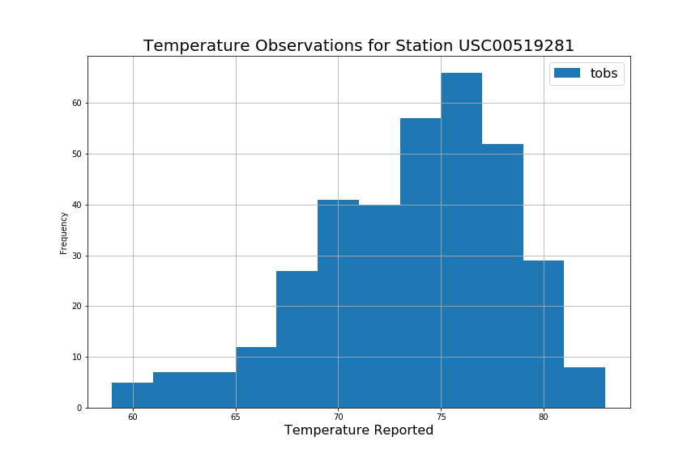

```python
# Python SQL toolkit and Object Relational Mapper
import sqlalchemy
from sqlalchemy.ext.automap import automap_base
from sqlalchemy.orm import Session
from sqlalchemy import create_engine, inspect, func
import datetime as dt
from dateutil.relativedelta import relativedelta
import pandas as pd
import numpy as np
import matplotlib.pyplot as plt
```


```python
# Connect to SQL database
engine = create_engine("sqlite:///hawaii.sqlite", echo=False)
```


```python
# Inspect database
inspector = inspect(engine)
inspector.get_table_names()
```


    ['measurements', 'stations']


```python
# Get a list of column names and types for measurements table
columns = inspector.get_columns('measurements')
for c in columns:
    print(c['name'], c["type"])
```

    id INTEGER
    station VARCHAR(255)
    date VARCHAR(255)
    prcp FLOAT
    tobs INTEGER
    


```python
# Get a list of column names and types for stations table
columns = inspector.get_columns('stations')
for c in columns:
    print(c['name'], c["type"])
```

    id INTEGER
    station VARCHAR(255)
    name VARCHAR(255)
    latitude FLOAT
    longitude FLOAT
    elevation FLOAT
    


```python
engine.execute('SELECT * FROM measurements LIMIT 5').fetchall()
```


    [(0, 'USC00519397', '2010-01-01', 0.08, 65),
     (1, 'USC00519397', '2010-01-02', 0.0, 63),
     (2, 'USC00519397', '2010-01-03', 0.0, 74),
     (3, 'USC00519397', '2010-01-04', 0.0, 76),
     (4, 'USC00519397', '2010-01-06', 0.0, 73)]


```python
# Reflect the tables into classes and save a reference to those classes called Station and Measurement
Base = automap_base()
Base.prepare(engine, reflect=True)
Measurement = Base.classes.measurements
Station = Base.classes.stations
```


```python
session = Session(engine)
```

# Precipitation Analysis


```python
# Earliest Date
session.query(Measurement.date).order_by(Measurement.date).first()
```


    ('2010-01-01')


```python
# Latest Date
latest_date = session.query(Measurement.date).order_by(Measurement.date.desc()).first().date
latest_date
```


    '2017-08-23'


```python
# Date 12 months from the latest date
last_twelve_months = dt.datetime.strptime(latest_date, '%Y-%m-%d') - dt.timedelta(days=365)
last_twelve_months
```


    datetime.datetime(2016, 8, 23, 0, 0)


```python
# Retrieve the last 12 months of precipitation data
p_results = session.query(Measurement.date, func.avg(Measurement.prcp)).\
                    filter(Measurement.date >= last_twelve_months).\
                    group_by(Measurement.date).all()
p_results
```


    [('2016-08-24', 1.3328571428571425),
     ('2016-08-25', 0.07714285714285715),
     ('2016-08-26', 0.016666666666666666),
     ('2016-08-27', 0.05333333333333332),
     ('2016-08-28', 0.5166666666666666),
     ('2016-08-29', 0.20857142857142857),
     ('2016-08-30', 0.011666666666666667),
     ('2016-08-31', 0.45428571428571424),
     ('2016-09-01', 0.005),
     ('2016-09-02', 0.03571428571428571),
     ('2016-09-03', 0.254),
     ('2016-09-04', 0.276),
     ('2016-09-05', 0.056666666666666664),
     ('2016-09-06', 0.205),
     ('2016-09-07', 0.3333333333333333),
     ('2016-09-08', 0.06571428571428573),
     ('2016-09-09', 0.15285714285714283),
     ('2016-09-10', 0.27999999999999997),
     ('2016-09-11', 0.25),
     ('2016-09-12', 0.22),
     ('2016-09-13', 0.3871428571428571),
     ('2016-09-14', 2.04),
     ('2016-09-15', 0.7085714285714285),
     ('2016-09-16', 0.11714285714285715),
     ('2016-09-17', 0.13599999999999998),
     ('2016-09-18', 0.10600000000000001),
     ('2016-09-19', 0.045714285714285714),
     ('2016-09-20', 0.14714285714285716),
     ('2016-09-21', 0.19499999999999998),
     ('2016-09-22', 0.2057142857142857),
     ('2016-09-23', 0.22428571428571428),
     ('2016-09-24', 0.04666666666666667),
     ('2016-09-25', 0.015),
     ('2016-09-26', 0.23857142857142857),
     ('2016-09-27', 0.22666666666666666),
     ('2016-09-28', 0.018571428571428572),
     ('2016-09-29', 0.42714285714285716),
     ('2016-09-30', 0.16428571428571428),
     ('2016-10-01', 0.2416666666666667),
     ('2016-10-02', 0.12),
     ('2016-10-03', 0.09857142857142857),
     ('2016-10-04', 0.49857142857142855),
     ('2016-10-05', 0.11714285714285715),
     ('2016-10-06', 0.022857142857142857),
     ('2016-10-07', 0.0014285714285714286),
     ('2016-10-08', 0.008),
     ('2016-10-09', 0.0),
     ('2016-10-10', 0.0),
     ('2016-10-11', 0.09857142857142856),
     ('2016-10-12', 0.013333333333333334),
     ('2016-10-13', 0.011428571428571429),
     ('2016-10-14', 0.0),
     ('2016-10-15', 0.065),
     ('2016-10-16', 0.0),
     ('2016-10-17', 0.07857142857142858),
     ('2016-10-18', 0.08571428571428572),
     ('2016-10-19', 0.024285714285714282),
     ('2016-10-20', 0.16833333333333333),
     ('2016-10-21', 0.045714285714285714),
     ('2016-10-22', 0.354),
     ('2016-10-23', 0.04666666666666666),
     ('2016-10-24', 0.11285714285714285),
     ('2016-10-25', 0.15714285714285717),
     ('2016-10-26', 0.04833333333333334),
     ('2016-10-27', 0.2657142857142857),
     ('2016-10-28', 0.08142857142857143),
     ('2016-10-29', 0.10666666666666667),
     ('2016-10-30', 0.26499999999999996),
     ('2016-10-31', 0.23),
     ('2016-11-01', 0.035),
     ('2016-11-02', 0.006666666666666667),
     ('2016-11-03', 0.0033333333333333335),
     ('2016-11-04', 0.008571428571428572),
     ('2016-11-05', 0.075),
     ('2016-11-06', 0.013333333333333334),
     ('2016-11-07', 0.025714285714285714),
     ('2016-11-08', 0.18666666666666668),
     ('2016-11-09', 0.05714285714285714),
     ('2016-11-10', 0.0016666666666666668),
     ('2016-11-11', 0.0),
     ('2016-11-12', 0.0),
     ('2016-11-13', 0.0),
     ('2016-11-14', 0.02142857142857143),
     ('2016-11-15', 0.0071428571428571435),
     ('2016-11-16', 0.22),
     ('2016-11-17', 0.008571428571428572),
     ('2016-11-18', 0.006),
     ('2016-11-19', 0.095),
     ('2016-11-20', 0.19),
     ('2016-11-21', 0.5133333333333333),
     ('2016-11-22', 0.7157142857142856),
     ('2016-11-23', 0.11166666666666668),
     ('2016-11-24', 0.296),
     ('2016-11-25', 0.22),
     ('2016-11-26', 0.085),
     ('2016-11-27', 0.09166666666666667),
     ('2016-11-28', 0.10285714285714286),
     ('2016-11-29', 0.06142857142857144),
     ('2016-11-30', 0.15142857142857144),
     ('2016-12-01', 0.25285714285714284),
     ('2016-12-02', 0.33714285714285713),
     ('2016-12-03', 0.45166666666666666),
     ('2016-12-04', 0.13333333333333333),
     ('2016-12-05', 0.4628571428571429),
     ('2016-12-06', 0.006666666666666667),
     ('2016-12-07', 0.054285714285714284),
     ('2016-12-08', 0.06571428571428573),
     ('2016-12-09', 0.30833333333333335),
     ('2016-12-10', 0.021666666666666667),
     ('2016-12-11', 0.05),
     ('2016-12-12', 0.0071428571428571435),
     ('2016-12-13', 0.11),
     ('2016-12-14', 0.21428571428571427),
     ('2016-12-15', 0.037142857142857144),
     ('2016-12-16', 0.005714285714285714),
     ('2016-12-17', 0.07),
     ('2016-12-18', 0.14833333333333334),
     ('2016-12-19', 0.060000000000000005),
     ('2016-12-20', 0.004285714285714286),
     ('2016-12-21', 0.1285714285714286),
     ('2016-12-22', 0.3528571428571428),
     ('2016-12-23', 0.1757142857142857),
     ('2016-12-24', 0.27),
     ('2016-12-25', 0.086),
     ('2016-12-26', 0.34),
     ('2016-12-27', 0.04),
     ('2016-12-28', 0.05857142857142857),
     ('2016-12-29', 0.33999999999999997),
     ('2016-12-30', 0.4785714285714286),
     ('2016-12-31', 0.42800000000000005),
     ('2017-01-01', 0.05833333333333333),
     ('2017-01-02', 0.004),
     ('2017-01-03', 0.0),
     ('2017-01-04', 0.03),
     ('2017-01-05', 0.15833333333333333),
     ('2017-01-06', 0.13333333333333333),
     ('2017-01-07', 0.01),
     ('2017-01-08', 0.01),
     ('2017-01-09', 0.0),
     ('2017-01-10', 0.0),
     ('2017-01-11', 0.0),
     ('2017-01-12', 0.0),
     ('2017-01-13', 0.0),
     ('2017-01-14', 0.002),
     ('2017-01-15', 0.002),
     ('2017-01-16', 0.0),
     ('2017-01-17', 0.0),
     ('2017-01-18', 0.01),
     ('2017-01-19', 0.002857142857142857),
     ('2017-01-20', 0.0),
     ('2017-01-21', 0.04666666666666666),
     ('2017-01-22', 0.20400000000000001),
     ('2017-01-23', 0.13428571428571429),
     ('2017-01-24', 0.375),
     ('2017-01-25', 0.5114285714285715),
     ('2017-01-26', 0.015714285714285715),
     ('2017-01-27', 0.008571428571428572),
     ('2017-01-28', 0.028000000000000004),
     ('2017-01-29', 0.198),
     ('2017-01-30', 0.0071428571428571435),
     ('2017-01-31', 0.0),
     ('2017-02-01', 0.0),
     ('2017-02-02', 0.0),
     ('2017-02-03', 0.0),
     ('2017-02-04', 0.0),
     ('2017-02-05', 0.0),
     ('2017-02-06', 0.054285714285714284),
     ('2017-02-07', 1.0571428571428572),
     ('2017-02-08', 0.1542857142857143),
     ('2017-02-09', 0.002857142857142857),
     ('2017-02-10', 0.0),
     ('2017-02-11', 1.866666666666667),
     ('2017-02-12', 1.7466666666666668),
     ('2017-02-13', 0.4171428571428571),
     ('2017-02-14', 0.0016666666666666668),
     ('2017-02-15', 0.011428571428571429),
     ('2017-02-16', 0.3171428571428571),
     ('2017-02-17', 0.17500000000000004),
     ('2017-02-18', 0.002),
     ('2017-02-19', 0.0475),
     ('2017-02-20', 0.0),
     ('2017-02-21', 0.021666666666666667),
     ('2017-02-22', 0.13000000000000003),
     ('2017-02-23', 0.0014285714285714286),
     ('2017-02-24', 0.0),
     ('2017-02-25', 0.0375),
     ('2017-02-26', 0.0),
     ('2017-02-27', 0.0),
     ('2017-02-28', 0.11714285714285713),
     ('2017-03-01', 1.6600000000000001),
     ('2017-03-02', 1.0933333333333333),
     ('2017-03-03', 0.31857142857142856),
     ('2017-03-04', 0.0),
     ('2017-03-05', 0.3025),
     ('2017-03-06', 0.07714285714285715),
     ('2017-03-07', 0.0),
     ('2017-03-08', 0.0),
     ('2017-03-09', 0.28),
     ('2017-03-10', 0.04142857142857143),
     ('2017-03-11', 0.008),
     ('2017-03-12', 0.0),
     ('2017-03-13', 0.0),
     ('2017-03-14', 0.008571428571428572),
     ('2017-03-15', 0.01),
     ('2017-03-16', 0.0),
     ('2017-03-17', 0.12),
     ('2017-03-18', 0.0),
     ('2017-03-19', 0.0),
     ('2017-03-20', 0.0033333333333333335),
     ('2017-03-21', 0.015),
     ('2017-03-22', 0.0),
     ('2017-03-23', 0.008333333333333333),
     ('2017-03-24', 0.18833333333333335),
     ('2017-03-25', 0.394),
     ('2017-03-26', 0.0),
     ('2017-03-27', 0.0016666666666666668),
     ('2017-03-28', 0.10142857142857144),
     ('2017-03-29', 0.027142857142857142),
     ('2017-03-30', 0.024999999999999998),
     ('2017-03-31', 0.0014285714285714286),
     ('2017-04-01', 0.06833333333333334),
     ('2017-04-02', 0.0),
     ('2017-04-03', 0.09428571428571429),
     ('2017-04-04', 0.02142857142857143),
     ('2017-04-05', 0.09428571428571429),
     ('2017-04-06', 0.008571428571428572),
     ('2017-04-07', 0.0),
     ('2017-04-08', 0.0),
     ('2017-04-09', 0.0),
     ('2017-04-10', 0.002857142857142857),
     ('2017-04-11', 0.06714285714285714),
     ('2017-04-12', 0.1542857142857143),
     ('2017-04-13', 0.15571428571428572),
     ('2017-04-14', 1.1199999999999999),
     ('2017-04-15', 0.34800000000000003),
     ('2017-04-16', 0.21400000000000002),
     ('2017-04-17', 0.4385714285714286),
     ('2017-04-18', 0.48),
     ('2017-04-19', 0.028571428571428574),
     ('2017-04-20', 0.11142857142857143),
     ('2017-04-21', 1.1971428571428573),
     ('2017-04-22', 0.9920000000000002),
     ('2017-04-23', 0.11499999999999999),
     ('2017-04-24', 0.008571428571428572),
     ('2017-04-25', 0.0),
     ('2017-04-26', 0.065),
     ('2017-04-27', 0.06),
     ('2017-04-28', 0.6057142857142858),
     ('2017-04-29', 1.3399999999999999),
     ('2017-04-30', 1.07),
     ('2017-05-01', 0.135),
     ('2017-05-02', 0.008333333333333333),
     ('2017-05-03', 0.006),
     ('2017-05-04', 0.013333333333333334),
     ('2017-05-05', 0.06333333333333334),
     ('2017-05-06', 0.01),
     ('2017-05-07', 0.024),
     ('2017-05-08', 0.5016666666666666),
     ('2017-05-09', 0.9260000000000002),
     ('2017-05-10', 0.14333333333333334),
     ('2017-05-11', 0.12),
     ('2017-05-12', 0.02666666666666667),
     ('2017-05-13', 0.048),
     ('2017-05-14', 0.244),
     ('2017-05-15', 0.14666666666666667),
     ('2017-05-16', 0.06999999999999999),
     ('2017-05-17', 0.025000000000000005),
     ('2017-05-18', 0.14166666666666666),
     ('2017-05-19', 0.01),
     ('2017-05-20', 0.005),
     ('2017-05-21', 0.002),
     ('2017-05-22', 0.06),
     ('2017-05-23', 0.11833333333333333),
     ('2017-05-24', 0.6483333333333333),
     ('2017-05-25', 0.37000000000000005),
     ('2017-05-26', 0.004),
     ('2017-05-27', 0.085),
     ('2017-05-28', 0.06833333333333334),
     ('2017-05-29', 0.084),
     ('2017-05-30', 0.28833333333333333),
     ('2017-05-31', 0.074),
     ('2017-06-01', 0.006666666666666667),
     ('2017-06-02', 0.056666666666666664),
     ('2017-06-03', 0.10166666666666667),
     ('2017-06-04', 0.19166666666666665),
     ('2017-06-05', 0.011428571428571429),
     ('2017-06-06', 0.0),
     ('2017-06-07', 0.0014285714285714286),
     ('2017-06-08', 0.004285714285714286),
     ('2017-06-09', 0.006666666666666667),
     ('2017-06-10', 0.255),
     ('2017-06-11', 0.35833333333333334),
     ('2017-06-12', 0.2916666666666667),
     ('2017-06-13', 0.19714285714285712),
     ('2017-06-14', 0.22428571428571428),
     ('2017-06-15', 0.3871428571428571),
     ('2017-06-16', 0.028571428571428574),
     ('2017-06-17', 0.09000000000000001),
     ('2017-06-18', 0.23666666666666666),
     ('2017-06-19', 0.10428571428571429),
     ('2017-06-20', 0.09166666666666667),
     ('2017-06-21', 0.085),
     ('2017-06-22', 0.07333333333333335),
     ('2017-06-23', 0.09571428571428571),
     ('2017-06-24', 0.128),
     ('2017-06-25', 0.12),
     ('2017-06-26', 0.014285714285714287),
     ('2017-06-27', 0.018333333333333333),
     ('2017-06-28', 0.005),
     ('2017-06-29', 0.01),
     ('2017-06-30', 0.07428571428571429),
     ('2017-07-01', 0.065),
     ('2017-07-02', 0.144),
     ('2017-07-03', 0.10571428571428572),
     ('2017-07-04', 0.037500000000000006),
     ('2017-07-05', 0.0),
     ('2017-07-06', 0.0033333333333333335),
     ('2017-07-07', 0.07142857142857142),
     ('2017-07-08', 0.016666666666666666),
     ('2017-07-09', 0.03333333333333333),
     ('2017-07-10', 0.005714285714285714),
     ('2017-07-11', 0.004285714285714286),
     ('2017-07-12', 0.051428571428571435),
     ('2017-07-13', 0.25857142857142856),
     ('2017-07-14', 0.15833333333333335),
     ('2017-07-15', 0.03166666666666667),
     ('2017-07-16', 0.135),
     ('2017-07-17', 0.15166666666666667),
     ('2017-07-18', 0.3614285714285714),
     ('2017-07-19', 0.06833333333333334),
     ('2017-07-20', 0.17714285714285713),
     ('2017-07-21', 0.018571428571428572),
     ('2017-07-22', 0.7366666666666667),
     ('2017-07-23', 0.22600000000000003),
     ('2017-07-24', 0.5449999999999999),
     ('2017-07-25', 0.08714285714285715),
     ('2017-07-26', 0.07142857142857142),
     ('2017-07-27', 0.0014285714285714286),
     ('2017-07-28', 0.11),
     ('2017-07-29', 0.10166666666666667),
     ('2017-07-30', 0.06),
     ('2017-07-31', 0.0),
     ('2017-08-01', 0.034999999999999996),
     ('2017-08-02', 0.075),
     ('2017-08-03', 0.017499999999999998),
     ('2017-08-04', 0.015),
     ('2017-08-05', 0.02),
     ('2017-08-06', 0.0),
     ('2017-08-07', 0.0125),
     ('2017-08-08', 0.11000000000000001),
     ('2017-08-09', 0.049999999999999996),
     ('2017-08-10', 0.0175),
     ('2017-08-11', 0.0),
     ('2017-08-12', 0.04666666666666667),
     ('2017-08-13', 0.0),
     ('2017-08-14', 0.062),
     ('2017-08-15', 0.164),
     ('2017-08-16', 0.1525),
     ('2017-08-17', 0.0475),
     ('2017-08-18', 0.015),
     ('2017-08-19', 0.0225),
     ('2017-08-20', 0.0033333333333333335),
     ('2017-08-21', 0.14500000000000002),
     ('2017-08-22', 0.16666666666666666),
     ('2017-08-23', 0.1325)]


```python
# Put data into dataframe
precipitation_df = pd.DataFrame(p_results, columns=['Date', 'Precipitation'])
precipitation_df.set_index('Date', inplace=True)
precipitation_df.head()
```


<div>
<style scoped>
    .dataframe tbody tr th:only-of-type {
        vertical-align: middle;
    }

    .dataframe tbody tr th {
        vertical-align: top;
    }

    .dataframe thead th {
        text-align: right;
    }
</style>
<table border="1" class="dataframe">
  <thead>
    <tr style="text-align: right;">
      <th></th>
      <th>Precipitation</th>
    </tr>
    <tr>
      <th>Date</th>
      <th></th>
    </tr>
  </thead>
  <tbody>
    <tr>
      <th>2016-08-24</th>
      <td>1.332857</td>
    </tr>
    <tr>
      <th>2016-08-25</th>
      <td>0.077143</td>
    </tr>
    <tr>
      <th>2016-08-26</th>
      <td>0.016667</td>
    </tr>
    <tr>
      <th>2016-08-27</th>
      <td>0.053333</td>
    </tr>
    <tr>
      <th>2016-08-28</th>
      <td>0.516667</td>
    </tr>
  </tbody>
</table>
</div>


```python
# Plot the precipitation for the past 12 months
ax = precipitation_df.plot(kind='bar', width=3, figsize=(12,8))
plt.locator_params(axis='x', nbins=6)
ax.xaxis.set_major_formatter(plt.NullFormatter())
ax.tick_params(axis='y', labelsize=16)
ax.grid(True)
plt.legend(bbox_to_anchor=(.3,1), fontsize="16")
plt.title("Precipitation Last 12 Months", size=20)
plt.ylabel("Precipitation (Inches)", size=18)
plt.xlabel("Date", size=18)
plt.savefig("Output/Precipitation.png")
plt.show
```


    <function matplotlib.pyplot.show>


```python
# Print the summary statistics for the precipitation data
precipitation_df.describe()
```


<div>
<style scoped>
    .dataframe tbody tr th:only-of-type {
        vertical-align: middle;
    }

    .dataframe tbody tr th {
        vertical-align: top;
    }

    .dataframe thead th {
        text-align: right;
    }
</style>
<table border="1" class="dataframe">
  <thead>
    <tr style="text-align: right;">
      <th></th>
      <th>Precipitation</th>
    </tr>
  </thead>
  <tbody>
    <tr>
      <th>count</th>
      <td>365.000000</td>
    </tr>
    <tr>
      <th>mean</th>
      <td>0.156103</td>
    </tr>
    <tr>
      <th>std</th>
      <td>0.275657</td>
    </tr>
    <tr>
      <th>min</th>
      <td>0.000000</td>
    </tr>
    <tr>
      <th>25%</th>
      <td>0.008571</td>
    </tr>
    <tr>
      <th>50%</th>
      <td>0.065000</td>
    </tr>
    <tr>
      <th>75%</th>
      <td>0.175714</td>
    </tr>
    <tr>
      <th>max</th>
      <td>2.040000</td>
    </tr>
  </tbody>
</table>
</div>


# Station Analysis


```python
# Calculate the total number of stations
session.query(Station.id).count()
```


    9


```python
# Design a query to find the most active stations.
# List the stations and observation counts in descending order
# Which station has the highest number of observations? - USC00519281 with 2772 observations
s_results = session.query(Measurement.station, func.count(Measurement.station)).\
            group_by(Measurement.station).\
            order_by(func.count(Measurement.station).desc()).all()
s_results
```


    [('USC00519281', 2772),
     ('USC00519397', 2724),
     ('USC00513117', 2709),
     ('USC00519523', 2669),
     ('USC00516128', 2612),
     ('USC00514830', 2202),
     ('USC00511918', 1979),
     ('USC00517948', 1372),
     ('USC00518838', 511)]


```python
# Using the station id from the previous query, calculate the lowest temperature recorded, 
# highest temperature recorded, and average temperature most active station?
best_station = s_results[0][0]
session.query(func.min(Measurement.tobs), func.avg(Measurement.tobs), func.max(Measurement.tobs)).\
                filter(Measurement.station == best_station).all()
```


    [(54, 71.66378066378067, 85)]


```python
# Choose the station with the highest number of temperature observations.
# Query the last 12 months of temperature observation data for this station and plot the results as a histogram
t_results = session.query(Measurement.station, Measurement.tobs).\
                filter(Measurement.station == best_station).\
                filter(Measurement.date >= last_twelve_months).all()
tobs_df = pd.DataFrame(t_results)
tobs_df.set_index('station', inplace=True)
tobs_df.head()
```


<div>
<style scoped>
    .dataframe tbody tr th:only-of-type {
        vertical-align: middle;
    }

    .dataframe tbody tr th {
        vertical-align: top;
    }

    .dataframe thead th {
        text-align: right;
    }
</style>
<table border="1" class="dataframe">
  <thead>
    <tr style="text-align: right;">
      <th></th>
      <th>tobs</th>
    </tr>
    <tr>
      <th>station</th>
      <th></th>
    </tr>
  </thead>
  <tbody>
    <tr>
      <th>USC00519281</th>
      <td>77</td>
    </tr>
    <tr>
      <th>USC00519281</th>
      <td>80</td>
    </tr>
    <tr>
      <th>USC00519281</th>
      <td>80</td>
    </tr>
    <tr>
      <th>USC00519281</th>
      <td>75</td>
    </tr>
    <tr>
      <th>USC00519281</th>
      <td>73</td>
    </tr>
  </tbody>
</table>
</div>


```python
# Plot the results as a histogram with bins=12.
tobs_df.plot.hist(by='station', bins=12, figsize=(12,8))
plt.grid()
plt.title("Temperature Observations for Station " + best_station, fontsize=20)
plt.xlabel("Temperature Reported", fontsize=16)
plt.legend(bbox_to_anchor=(1,1), fontsize=16)
plt.savefig("Output/StationTemps.png")
plt.show
```


    <function matplotlib.pyplot.show>





# Temperature Analysis


```python
# Write a function called calc_temps that will accept a start date and end date in the format %Y-%m-%d 
# and return the minimum, average, and maximum temperatures for that range of dates.
def calc_temps(start_date, end_date):
    c_results = session.query(func.min(Measurement.tobs), func.avg(Measurement.tobs), func.max(Measurement.tobs)).\
                    filter(Measurement.date >= start_date).\
                    filter(Measurement.date <= end_date).all()
    return c_results
calc_temps('2017-01-01', '2017-12-31')
```


    [(58, 74.14387974230493, 87)]


```python
# Use your previous function `calc_temps` to calculate the tmin, tavg, and tmax 
# for your trip using the previous year's data for those same dates.
trip_results = calc_temps('2017-07-02', '2017-07-08')
trip_results
```


    [(71, 78.11904761904762, 87)]


```python
# Plot the results from your previous query as a bar chart. 
# Use "Trip Avg Temp" as your Title
# Use the average temperature for the y value
# Use the peak-to-peak (tmax-tmin) value as the y error bar (yerr)
trip_df = pd.DataFrame(trip_results, columns=['Min Temp', 'Avg Temp', 'Max Temp'])
avg_temp = trip_df['Avg Temp']
min_max_temp = trip_df.iloc[0]['Max Temp'] - trip_df.iloc[0]['Min Temp']
avg_temp.plot(kind='bar', yerr=min_max_temp, figsize=(6,8), alpha=0.5, color='coral')
plt.title("Trip Avg Temp", fontsize=20)
plt.ylabel("Temp (F)")
plt.xticks([])
plt.grid()
plt.savefig("Output/TripTempSummary.png")
plt.show()
```


